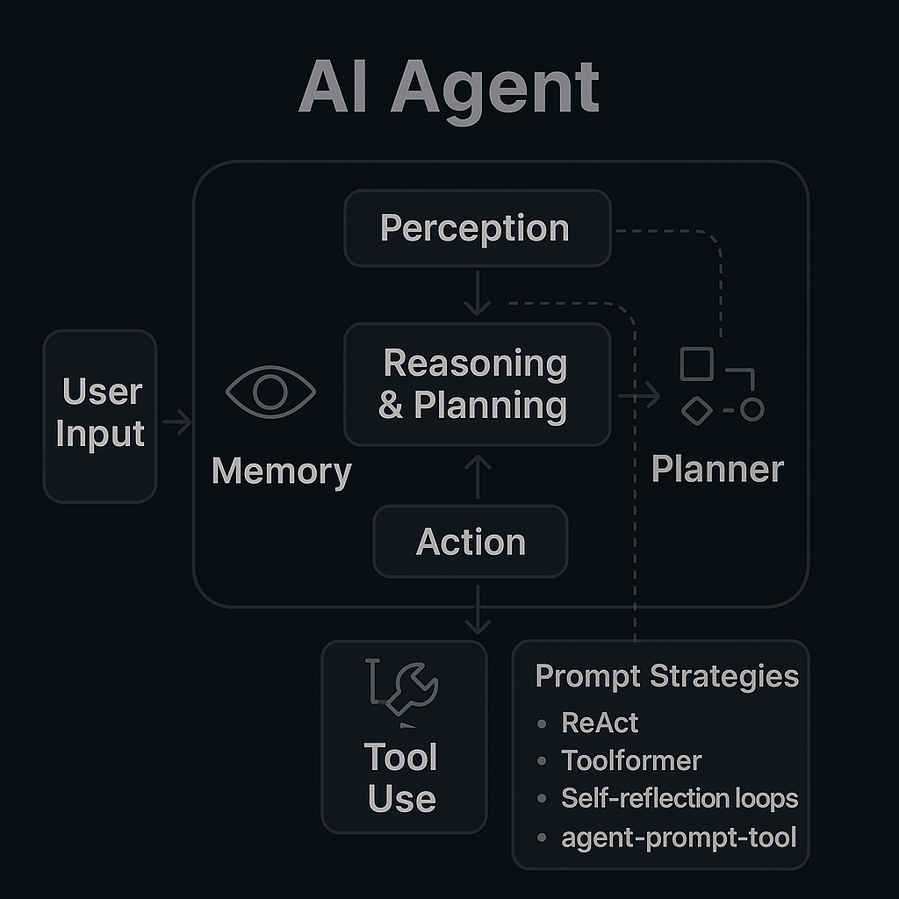
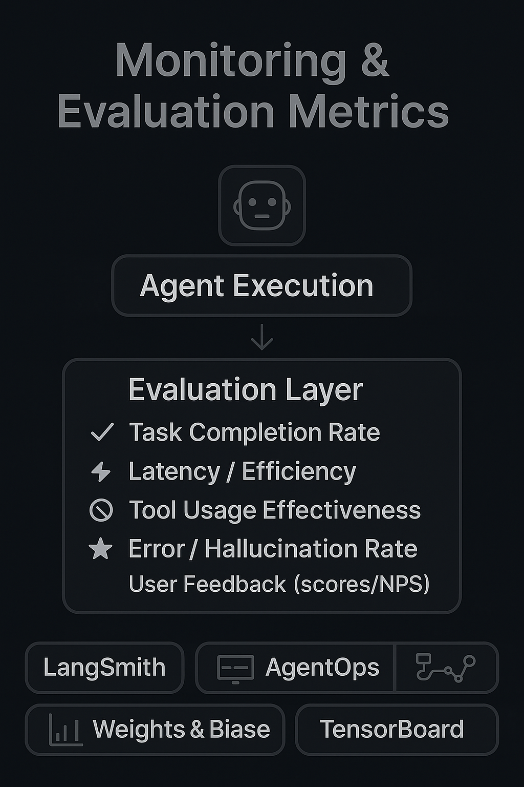

# 🧠 Understanding AI Agents

### A Deep Dive into Their Design, Training, and Monitoring

---

## 🚀 Introduction

Artificial Intelligence (AI) agents are transforming how we interact with technology. Unlike traditional chatbots or static models, AI agents are **autonomous systems** that can perceive, reason, act, and adapt over time.

This guide explores:

* What AI agents are
* Core components and architecture
* How they are built and orchestrated
* Prompting strategies that shape their reasoning
* How to monitor and evaluate their performance
* Tools, frameworks, and future directions

---

## 🤖 What is an AI Agent?

An **AI agent** is a system that operates autonomously within an environment by:

1. **Perceiving** the environment (inputs)
2. **Reasoning & Planning** over perceived data
3. **Acting** on the environment (outputs)
4. **Learning** from outcomes

**Key Characteristics:**

* **Autonomy**: Executes tasks independently
* **Proactivity**: Pursues goals, not just reactions
* **Memory**: Retains and recalls past interactions
* **Interactivity**: Engages intelligently with users/environment
* **Adaptability**: Improves from successes and failures

**Examples:**

* 🧑‍💼 Personal productivity agents (Notion AI, Rewind)
* 🔍 Research assistants (AutoGPT, Devin)
* 📊 Business automation bots (Zapier + AI, Salesforce Agents)

---

## 🧱 Core Components of an AI Agent

### 1. **Perception Module**

Handles external inputs such as:

* Natural language (via LLMs)
* API responses
* Sensor data

### 2. **Reasoning & Planning**

* Chain-of-thought prompting
* Task decomposition (ReAct, Toolformer, etc.)
* Decision-making with rules or priors

### 3. **Action Module**

* Executes API calls, tools, scripts
* Updates memory/state

### 4. **Memory System**

* **Short-term**: dialogue, task buffers
* **Long-term**: vector DBs (FAISS, Chroma), KV storage

### 5. **Feedback Loop**

* Monitors success/failure
* Logs metrics & adjusts behavior
* May use RL, heuristics, or human corrections

---

## 🧵 Prompt Strategies

Prompting guides how agents **reason, plan, and act**.

* **ReAct**: Interleaves reasoning + acting steps
* **Toolformer**: Dynamically predicts tool use
* **Self-reflection loops**: Agent critiques & revises outputs
* **Agent-prompt-tool**: Framework for chaining prompts with tools

---

## 🛠️ How Are AI Agents Built?

### 🧪 Frameworks

* **LangChain**: Memory, tool use, orchestration
* **AutoGen**: Multi-agent collaboration
* **CrewAI / MetaGPT**: Role-based task management

### 🔧 Tools & APIs

* **Search**: SerpAPI, Tavily
* **Web**: Puppeteer, browser automation
* **File processing**: Unstructured.io, LlamaParse
* **APIs**: Zapier, Stripe, Twilio, Notion

---

## 🎓 Training vs Orchestration

Agents are **modular** — built from pre-trained parts orchestrated into workflows.

| Component      | Trained | Notes                         |
| -------------- | ------- | ----------------------------- |
| LLM            | ✅       | GPT-4, Claude, Mistral        |
| Tool Wrappers  | ❌       | APIs, shell commands          |
| Memory Systems | ❌       | FAISS, Redis, vector DBs      |
| Planning Logic | Partial | Scripted or learned           |
| Feedback Loops | ✅/❌     | RLHF or heuristic adjustments |

---

## 📊 Monitoring & Evaluation

Evaluation is critical for open-ended tasks.

**Metrics:**

* Task completion rate
* Latency & efficiency
* Tool usage quality
* Error/hallucination rate
* User satisfaction (NPS, scores)

**Tools:**

* **LangSmith**: Tracing, spans, memory insights
* **AgentOps**: Agent state + failover monitoring
* **Weights & Biases**: Logs, dashboards, experiments
* **TensorBoard**: Model metrics & visualization

---

## 🔮 Future Directions

* 🤝 Multi-agent collaboration (swarm AI)
* 🧠 Persistent personal memory layers
* 🔐 Privacy-preserving agents (on-device, encrypted)
* 📱 Agent marketplaces (plug-and-play taskbots)
* ⚖️ Governance & regulation of autonomy

---

## 📎 Conclusion

AI agents are **more than chatbots** — they’re evolving into **autonomous systems with reasoning, memory, tools, and goals**.

As frameworks mature, learning how to **design, orchestrate, and evaluate** these agents is becoming a key skill for developers, businesses, and policymakers.

> Want to try building one? Start with **LangChain, AutoGen, or CrewAI** — and begin orchestrating intelligence.

---

🌐 [GitHub Pages](https://JenLaur.github.io/ai-agents-guide/)
🧠 Created by *Jennifer L. Sentiff*
🛠️ Powered by GPT-4 + Custom Visuals

---
